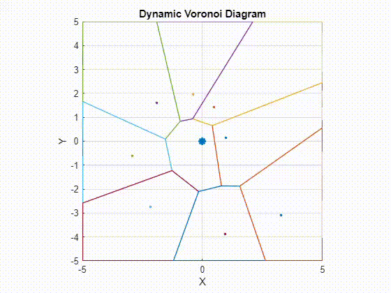

# gravitational-analysis

This project simulates a dynamic Voronoi diagram where points orbit a central point, creating an ever-changing Voronoi tessellation.

## Animation



---

## Getting Started

### Running the Simulation

1. Clone this repository:
   ```bash
   git clone https://github.com/MrEstebato/gravitational-analysis.git
   cd gravitational-analysis
   ```

2. Open `solarSystem.m` in MATLAB.

3. Run the script:
   ```matlab
   solarSystem
   ```

The simulation will display a dynamic Voronoi diagram with orbiting points.

---

## File Descriptions

- **`solarSystem.m`:** Main script for initializing the simulation and rendering the dynamic Voronoi diagram.
- **`voronoiDiagram.m`:** Function for computing and plotting Voronoi cells dynamically.

---

## Customization

Modify the following parameters in `solarSystem.m` to customize the simulation:

- **`radii`:** Distance of each orbiting point from the center.
- **`speeds`:** Angular speed of each orbiting point.
- **`num_points`:** Number of orbiting points (default is 8).
- **`padding`:** Space around the plot for better visualization.


### Next Steps
- Apply real physics with gravitational constants.
- Modify the algorithm to create a weighed voronoi diagram
